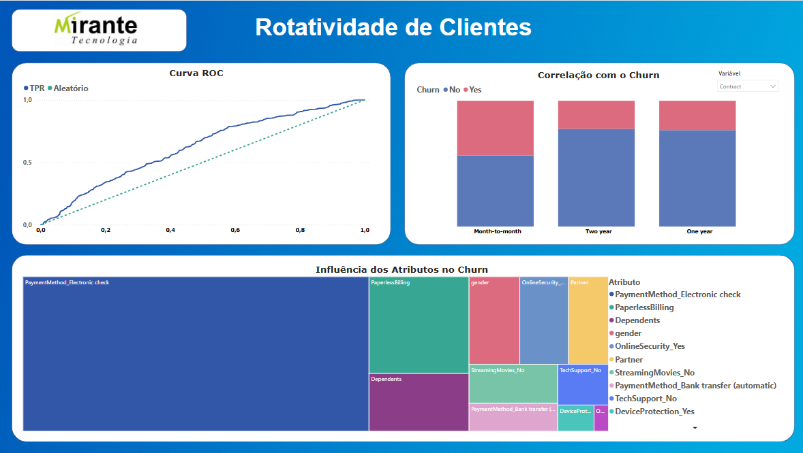
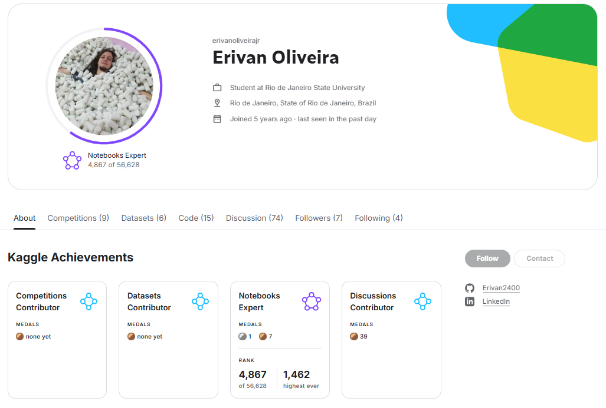

<!-- Badges -->
<p align="center">


</p>

<h1 align="center">Análise e Previsão de Churn para Empresa de Telecomunicações</h1>

📝 Descrição do Projeto
Este projeto consiste em uma solução de ponta a ponta para o problema de rotatividade de clientes (churn) em uma empresa de telecomunicações. O objetivo é analisar um conjunto de dados para descobrir os principais fatores que levam ao cancelamento de serviços e, a partir desses insights, construir e avaliar um modelo de machine learning capaz de prever quais clientes estão em risco.

O trabalho abrange desde a limpeza e análise exploratória dos dados até o treinamento, comparação de modelos, interpretação de resultados e a criação de um pipeline automatizado, visando entregar uma solução robusta, reprodutível e com insights acionáveis para a área de negócios.



## 📂 Estrutura de Pastas

O repositório está organizado da seguinte forma para garantir clareza, modularidade e reprodutibilidade:

```text
churn-prediction-challenge/
|
|-- data/
|   |-- 01_raw/                 # Dados originais e imutáveis
|   |-- 02_processed/           # Dados intermediários após limpeza
|   |-- 03_output/              # Arquivos finais gerados (ex: previsões)
|
|-- notebooks/
|   |-- 01_EDA.ipynb            # Notebook para Análise Exploratória de Dados
|   |-- 02_Modeling.ipynb       # Notebook para experimentação e comparação de modelos
|
|-- src/
|   |-- data_preprocessing.py   # Script para pré-processamento dos dados
|   |-- train_model.py          # Script para treinamento do modelo
|   |-- evaluate_model.py       # Script para avaliação do modelo
|
|-- reports/
|   |-- Decision_Log.md         # Log com justificativas das decisões técnicas
|
|-- .github/workflows/
|   |-- pipeline.yml            # Define a pipeline de automação (CI/CD)
|
|-- .gitignore                  # Arquivos e pastas ignorados pelo Git
|-- images                      # imagens do projeto
|-- models                      # Modelos treinados e artefatos serializados 
|-- Dockerfile                  # Receita para criar o ambiente em um container
|-- README.md                   # Documentação principal (este arquivo)
|-- requirements.txt            # Lista de dependências Python
```

🚀 Instalação e Execução
Siga os passos abaixo para configurar e executar o projeto em seu ambiente local.

Pré-requisitos
`Git`

`Python` (versão 3.9 ou superior)

Passo a Passo para Instalação
Clone o repositório:

`git clone https://github.com/ErivanJunior2400 churn-prediction-challenge.git`
`cd churn-prediction-challenge`

Crie e ative um ambiente virtual:

# Cria o ambiente
`python -m venv venv`

# Ativa o ambiente no Windows
`.\venv\Scripts\activate`
# (Alternativa para macOS/Linux)
`source venv/bin/activate`

Instale as dependências:

`pip install -r requirements.txt`

⚡ Exemplo de Execução
Após a instalação, a análise completa e o treinamento do modelo podem ser executados através do Jupyter Notebook principal.

Inicie o Jupyter Lab:

`jupyter lab`
Execute o Notebook:

No menu à esquerda do Jupyter Lab, navegue até a pasta /notebooks.

Abra o notebook principal (ex: 1.0-analise-e-modelagem.ipynb).

Para executar todo o processo, vá ao menu superior e clique em Kernel > Restart Kernel and Run All Cells....

✅ Testes Automatizados
Para garantir a qualidade e a confiabilidade das funções de pré-processamento, foram implementados testes unitários utilizando a biblioteca pytest.

Executando os Testes
Com o ambiente virtual ativado, você pode rodar todos os testes automatizados com um único comando na raiz do projeto:

`pytest`

Isso descobrirá e executará automaticamente todos os testes localizados na pasta /tests.

Nota sobre Badges: Os badges de Build e Cobertura de Testes no topo deste README são exemplos de como um projeto com Integração Contínua (CI/CD) via GitHub Actions se apresentaria. Eles refletem a intenção de seguir as melhores práticas, mesmo que a pipeline de CI completa não seja o foco deste desafio.


Relatório do Projeto Telco Customer Churn
# 1. Principais Decisões de Pré-processamento
Nesta etapa, o objetivo foi transformar os dados brutos em um formato adequado para a modelagem, garantindo a qualidade e o poder preditivo das features.

Limpeza e Tratamento de Nulos: As colunas MonthlyCharges e TotalCharges foram convertidas para o tipo numérico. Valores ausentes em TotalCharges (presentes para clientes novos com tenure zero) foram preenchidos com a mediana da coluna para evitar a perda de dados.
Codificação de Variáveis Categóricas:
Label Encoding: Foi aplicado à coluna Contract por ter uma hierarquia clara (Month-to-month, One year, Two year). Outras colunas binárias como gender, Partner e Dependents também foram codificadas com rótulos (0 ou 1), pois já representam um formato numérico para o modelo.
One-Hot Encoding: Foi utilizado para colunas com múltiplas categorias sem uma ordem inerente, como PaymentMethod, InternetService e OnlineSecurity. O resultado foi convertido para o tipo int para otimização de memória.
Normalização de Atributos Numéricos:
tenure e MonthlyCharges foram escalados para um intervalo de 0 a 1 usando o MinMaxScaler, tornando-os comparáveis entre si.
TotalCharges, que apresentava uma forte assimetria, foi transformado com o método Yeo-Johnson para torná-lo mais próximo de uma distribuição normal. Em seguida, foi padronizado com o StandardScaler. Essa abordagem em duas etapas melhora o desempenho de modelos lineares.
Variável Alvo: A coluna Churn foi mapeada para 1 (Yes) e 0 (No), facilitando o treinamento do modelo de classificação.

# 2. Escolha de Algoritmo e Otimização
Para estabelecer uma linha de base, a Regressão Logística foi escolhida devido à sua simplicidade, interpretabilidade e eficiência para problemas de classificação binária.

Ajuste para Dados Desbalanceados: O parâmetro class_weight='balanced' foi crucial para lidar com o desbalanceamento da variável Churn (65% 'No' vs. 35% 'Yes'). Este ajuste fez o modelo focar na classe minoritária ('Yes'), que é a que o negócio quer prever.
Otimização de Hiperparâmetros: Uma busca em grade (GridSearchCV) foi realizada para encontrar a melhor combinação de hiperparâmetros para o modelo, otimizando o Recall da classe 'Yes'.
Melhores Parâmetros Encontrados: {'C': 0.0886, 'penalty': 'l1'}.

# 3. Métricas Alcançadas
As métricas foram avaliadas no conjunto de teste, que o modelo nunca viu, para garantir que os resultados fossem realistas.

Recall (Foco Principal): 0.7717 (ou 77.17%). Este é o resultado mais importante para o negócio. Significa que o modelo é capaz de identificar corretamente mais de 77% dos clientes que realmente irão cancelar o serviço.
AUC-ROC: 0.6194. Uma pontuação de AUC acima de 0.5 indica que o modelo tem poder preditivo e consegue distinguir entre as classes, embora ainda haja espaço para melhorias com outros algoritmos.
Outras Métricas (no conjunto de teste): Acurácia (0.55), Precision (0.42), F1-Score (0.54). O Recall é notavelmente maior que a Precision, o que é esperado devido ao ajuste de class_weight, refletindo a prioridade de encontrar churners.

# 4. Insights de Negócio
A interpretação do modelo revelou os principais fatores que influenciam o churn, fornecendo insights acionáveis para o negócio.

Principal Fator de Retenção: A duração do contrato (Contract) é o atributo mais forte para a lealdade do cliente. Clientes com contratos de 1 ou 2 anos têm uma probabilidade muito menor de churn, o que sugere a importância de programas de fidelidade ou incentivos para contratos mais longos.
Principal Fator de Churn: O método de pagamento 'Cheque Eletrônico' está fortemente associado a uma maior probabilidade de churn. Este grupo de clientes representa um alto risco e deve ser o principal alvo de campanhas de retenção.
Lealdade: Clientes com maior tempo de contrato (tenure) e maior gasto total (TotalCharges) são mais propensos a permanecer.
Outros Fatores: Ter dependentes (Dependents) e o tipo de serviço de internet também influenciam o churn, embora com menor peso.


---

### Sobre o Autor

**[Erivan José de Oliveira Júnior]**

Um entusiasta de dados e Machine Learning com experiência prática em competições de modelagem preditiva e construção de pipelines de dados. 

* **🥈 Medalhista de Prata do Kaggle** - Veja meu perfil [aqui](https://www.kaggle.com/seu-usuario).
* **LinkedIn:** [linkedin.com/in/erivan-oliveira-365027185](https://www.linkedin.com/in/erivan-oliveira-365027185)


---